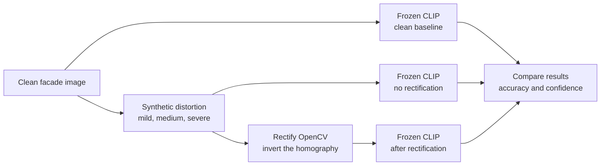

# RectifyCLIP

Does classical (OpenCV-based) perspective rectification recover the zero-shot
architectural-style classification accuracy that a frozen CLIP model loses
under controlled synthetic perspective distortion of building facade images?

Solo research project for course BCSE417L Machine Vision, VIT. Target output is
a short research paper. This is a **controlled empirical study, not a
new-method paper** — the novelty is isolating one variable (perspective
distortion, with vs. without classical rectification) on a frozen foundation
model, not a new technique.

## Architecture



## Dataset

**MonuMAI** — 1,514 expert-labelled images across 4 architectural styles
(Hispanic-Muslim, Gothic, Renaissance, Baroque).

- Source (official): https://github.com/ari-dasci/OD-MonuMAI — dataset contents
  live in that repo's `MonuMAI_dataset/` subfolder.
- Citation: Lamas, A. et al., *MonuMAI: Dataset, Deep Learning Pipeline and
  Citizen Science Based App for Monument Recognition*. (Verify exact venue/year
  before submission — not independently confirmed here.)

### Download instructions

Images are **not committed to this repo** (`data/` is gitignored). To
reproduce locally:

```bash
git clone --depth 1 https://github.com/ari-dasci/OD-MonuMAI.git /tmp/OD-MonuMAI
cp -r /tmp/OD-MonuMAI/MonuMAI_dataset/. data/monumai/
rm -rf /tmp/OD-MonuMAI
```

Expected layout after download:

```
data/monumai/
├── Baroque/           (516 images + xml/ Pascal VOC annotations)
├── Gothic/            (359 images + xml/)
├── Hispanic-Muslim/   (327 images + xml/)
└── Renaissance/       (312 images + xml/)
```

The `xml/` object-detection annotations are not used by this project — only
whole-image classification labels (the folder name) are needed.

## Setup

```bash
python -m venv .venv
.venv\Scripts\python.exe -m pip install -r requirements.txt   # CPU-only PyTorch, no CUDA
```

## Status

Day 1 (repo, environment, dataset, first CLIP forward pass) complete. See
`experiments/logs/day1.md` and `RectifyCLIP_Execution_Plan.md` for the full
day-by-day plan and progress log.
