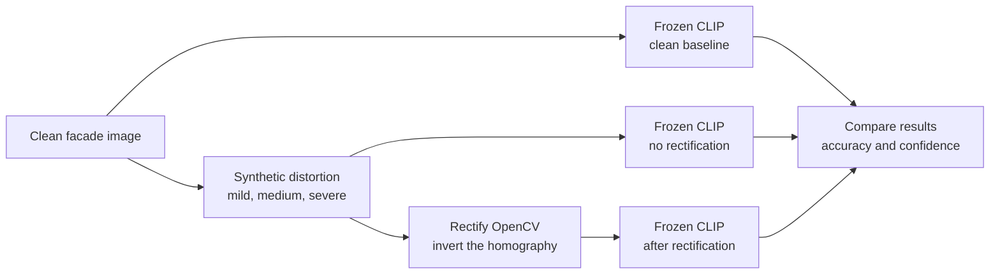

# RectifyCLIP

Does classical (OpenCV-based) perspective rectification recover the zero-shot
architectural-style classification accuracy that a frozen CLIP model loses
under controlled synthetic perspective distortion of building facade images?

Solo research project for course BCSE417L Machine Vision, VIT. This is a
**controlled empirical study, not a new-method paper** — the novelty is
isolating one variable (perspective distortion, with vs. without classical
rectification) on a frozen foundation model, not a new technique. Full
write-up: [`paper/draft.md`](paper/draft.md). Day-by-day process and
reasoning: [`experiments/logs/`](experiments/logs/).

## Architecture



## Headline results

1,514 MonuMAI images, CLIP ViT-B/32 (`laion2b_s34b_b79k`), zero-shot, no
fine-tuning. Full numbers: [`results/tables/day5_headline.md`](results/tables/day5_headline.md),
[`results/tables/day6_recovery.md`](results/tables/day6_recovery.md).

| Severity | Clean | Distorted | Rectified | Recovery % | Statistically significant? |
|---|---|---|---|---|---|
| mild | 61.4% | 60.8% | 60.2% | −90.0% | **No** (McNemar p=0.52 — inconclusive, not a real effect) |
| medium | 61.4% | 57.8% | 60.5% | 74.5% | Yes (p=0.005) |
| severe | 61.4% | 55.4% | 61.4% | 98.9% | Yes (p<0.0001) |

**Rectification does not help all 4 architectural styles equally** — it has
a consistently *negative* effect on Gothic facades (−51.4% pooled recovery,
at every severity individually) even as it strongly benefits others
(Baroque: +105.5%, exceeding its own clean accuracy). Digging into *why*
uncovered the project's most interesting result: a systematic
**"Renaissance attractor" bias** — CLIP defaults to a Renaissance prediction
for ambiguous distorted facades far more than chance would suggest (57.4% of
all rectification failures land on a wrong Renaissance prediction; 82.4% of
rectification's successes were fixing a wrong-Renaissance prediction). This
explains the pre-existing Baroque→Renaissance confusion visible even on
clean images, and why Baroque — the weakest class at baseline (34.1% clean
accuracy) — sees the largest raw benefit from rectification. A competing
hypothesis (that pixel-level reconstruction error, not this bias, predicted
which classes would recover) was tested and **refuted**. See
[`paper/draft.md`](paper/draft.md) Sections 4.3-4.5 and
[`experiments/logs/day6.md`](experiments/logs/day6.md) for the full analysis.

**Honest summary**: classical rectification is a real, substantial remedy at
medium/severe perspective distortion, inconclusive at mild distortion (where
distortion itself barely hurts to begin with), and not a uniform fix across
classes — a null or negative result for one specific class (Gothic) is
reported here, not hidden.

## Dataset

**MonuMAI** — 1,514 expert-labelled images across 4 architectural styles
(Hispanic-Muslim, Gothic, Renaissance, Baroque).

- Source (official): https://github.com/ari-dasci/OD-MonuMAI — dataset contents
  live in that repo's `MonuMAI_dataset/` subfolder.
- Citation: Lamas, A. et al., *MonuMAI: Dataset, Deep Learning Pipeline and
  Citizen Science Based App for Monument Recognition*. (Verify exact venue/year
  before submission — not independently confirmed here.)

### Download instructions

Images are **not committed to this repo** (`data/` is gitignored). To
reproduce locally:

```bash
git clone --depth 1 https://github.com/ari-dasci/OD-MonuMAI.git /tmp/OD-MonuMAI
cp -r /tmp/OD-MonuMAI/MonuMAI_dataset/. data/monumai/
rm -rf /tmp/OD-MonuMAI
```

Expected layout after download:

```
data/monumai/
├── Baroque/           (516 images + xml/ Pascal VOC annotations)
├── Gothic/            (359 images + xml/)
├── Hispanic-Muslim/   (327 images + xml/)
└── Renaissance/       (312 images + xml/)
```

The `xml/` object-detection annotations are not used by this project — only
whole-image classification labels (the folder name) are needed.

## Setup

```bash
python -m venv .venv
.venv\Scripts\python.exe -m pip install -r requirements.txt   # CPU-only PyTorch, no CUDA
```

Tested on Windows + Python 3.13.3, local CPU only (no GPU, no Colab used at
any point in this project — see `experiments/logs/day5.md`).

## How to reproduce

Once `.venv` is set up and `data/monumai/` is populated (above):

```bash
bash reproduce.sh
```

Runs the full pipeline in the same order it was built — Day 2's clean
baseline, Day 3/4's distortion and rectification galleries, Day 5's full
13,626-row experimental grid (~18 min), and Day 6's complete analysis
(recovery %, severity curve, per-class breakdown, failure gallery, confidence
+ prompt-sensitivity rerun, ~20 min). Total runtime ~35-40 minutes on CPU.
Every step is seeded (seed=42) and deterministic — rerunning reproduces
byte-identical CSVs and numerically identical figures every time (verified
directly: see `experiments/logs/day3.md`'s cross-process hash check and
`experiments/logs/day6.md`'s Day5-vs-Day6 internal consistency check).

To inspect individual pieces rather than the whole pipeline, each `src/*.py`
module has its own CLI — e.g. `python src/clip_zero_shot.py --image
data/monumai/Gothic/<file>.jpg` for a single-image check, or `python
src/distortion.py --gallery` to rebuild just the distortion gallery.

## Repository structure

```
rectify-clip/
├── configs/default.yaml         model, prompt, seed, paths
├── data/monumai/                dataset, gitignored — see Download instructions
├── src/
│   ├── data_loader.py           load_monumai(root) -> [(image_path, label), ...]
│   ├── clip_zero_shot.py        CLIP loading + zero-shot classification (single-image and batch)
│   ├── distortion.py            distort(image, severity, seed) -> (image, H)
│   ├── rectification.py         rectify_oracle(image, H) -> image, border-policy machinery
│   ├── experiment_runner.py     Day 5's full grid: image x severity x condition
│   ├── day6_analysis.py         Day 6's analysis: recovery %, severity curve, per-class,
│   │                            failure gallery, confidence + prompt-sensitivity rerun
│   └── metrics.py                accuracy, confusion matrix, McNemar's exact test
├── tests/                       runnable reproducibility/correctness tests (plain assert, no pytest)
├── experiments/
│   ├── logs/dayN.md             day-by-day process, decisions, numbers, dead ends
│   └── configs/                 per-run JSON configs (seed, prompt, git hash)
├── results/
│   ├── raw/                     per-image predictions, CSV (gitignored, large)
│   └── tables/                  aggregated markdown tables (headline, recovery, per-class, ...)
├── figures/                     plots, galleries — always regenerable from results/
├── paper/draft.md                the paper itself
├── reproduce.sh                  single-command "reproduce everything" script
└── notebooks/                    exploration only — never the source of truth
```

## License

MIT — see [`LICENSE`](LICENSE).
